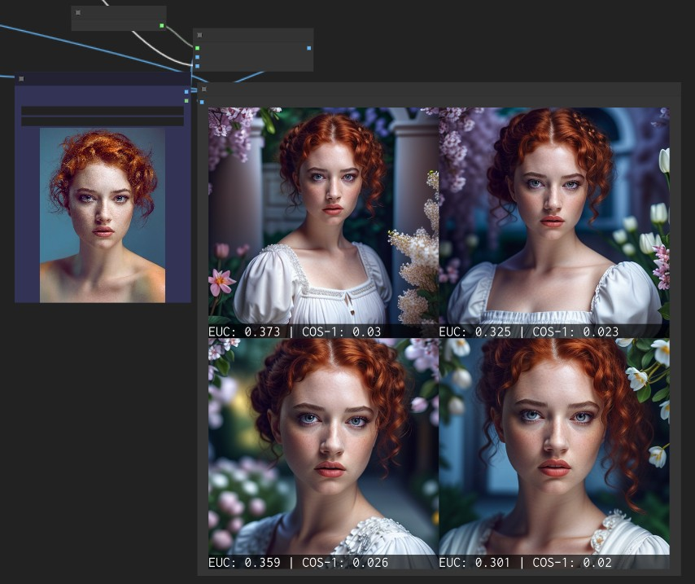

# Face Analysis for ComfyUI

This extension uses [DLib](http://dlib.net/) or [InsightFace](https://github.com/deepinsight/insightface) to perform various operations on human faces.

The most obvious is to calculate the similarity between two faces. The best way to evaluate generated faces is to first send a batch of 3 reference images to the node and compare them to a forth reference (all actual pictures of the person). That will give you a baseline number that you can use to compare to generated images.

> [!IMPORTANT]  
> **2025.04.14** - I do not use ComfyUI as my main way to interact with Gen AI anymore as a result I'm setting the repository in "maintenance only" mode. If there are crucial updates or PRs I might still consider merging them but I do not plan any consistent work on this repo.

## Installation

You need to install either InsightFace or Dlib (or both).

For DLIB download [Shape Predictor](https://huggingface.co/matt3ounstable/dlib_predictor_recognition/resolve/main/shape_predictor_68_face_landmarks.dat?download=true), [Face Predictor 5 landmarks](https://huggingface.co/matt3ounstable/dlib_predictor_recognition/resolve/main/shape_predictor_5_face_landmarks.dat?download=true), [Face Predictor 81 landmarks](https://huggingface.co/matt3ounstable/dlib_predictor_recognition/resolve/main/shape_predictor_81_face_landmarks.dat?download=true) and the [Face Recognition](https://huggingface.co/matt3ounstable/dlib_predictor_recognition/resolve/main/dlib_face_recognition_resnet_model_v1.dat?download=true) models and place them into the `dlib` directory.

Precompiled Dlib for Windows can be found [here](https://github.com/z-mahmud22/Dlib_Windows_Python3.x).

The extension also supports [AuraFace](https://huggingface.co/fal/AuraFace-v1/tree/main) that is a free alternative to InsightFace. Download all the files and place them under `models/insightface/models/auraface/`
